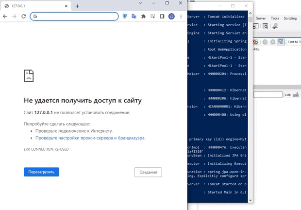

# Веб-приложение To-Do List
_________

## Описание приложения
Даёт возможность составить список дел
и его отредактировать: удалить, пометить выполненным, 
очистить список.  
  
__Приложение состоит из:__  
- Одностраничного веб-сайта, с использованием Thymeleaf и Spring Boot
- Базы данных MySQL

### Для запуска приложения необходимо:
1. Скачать файлы `ToDoList-1.0.jar` и `application.yml` в одну директорию
2. Настроить данные подключения к БД в `application.yml`
    + Указать метод взаимодествия с БД:  
   `spring.jpa.hibernate.ddl-auto:`
      
    + Задать параметры для подключения к БД:  
      `spring.datasource.url:`  
      `spring.datasource.username:`  
      `spring.datasource.password:`
3. Запустить выполнение `ToDoList-1.0.jar`

### Демонстрайия взаимодействия для пользователя
 
 